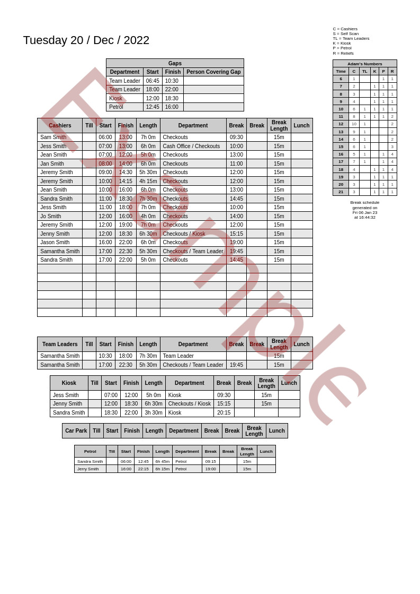
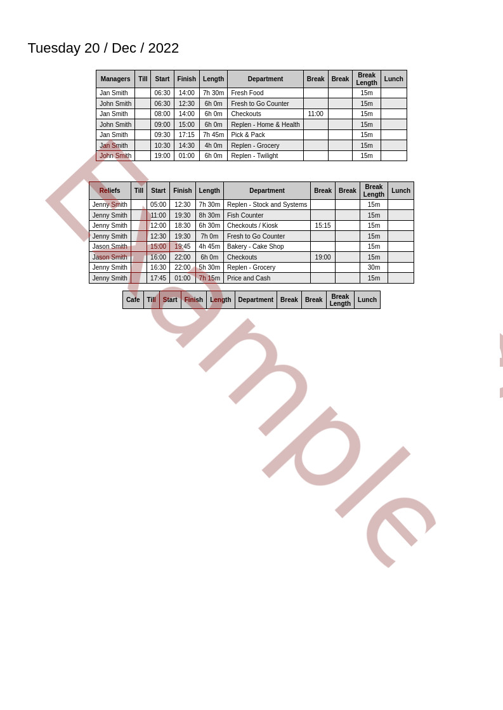

# Break Schedule Generator for Morrisons Supermarket

A nicer layout for your break schedule to help run checkouts with.
You log in to your morrisons account, go to the store schedule, save that page by following the instructions in the guide, and drag and drop that file into this program.

It will generate 1 week's worth of Break Schedules at a time.
Example of the output is here [Example Output](example_output.html).


## Features
* Nice clean layout.
* Easy print out in the form of a webpage that is formatted to fit on A4.
* See multiple departments on one page
* See checkout reliefs and magagers on the second page, always know who to call when it gets busy.
* Gaps alert - at the top of every page is a report of which departments have no staff scheduled in.
* Staff per hour count - I called this Adam's Numbers, after the Team Leader that came up with the idea. By having a count of how many staff we have at each hour, it makes it easier to plan for when to send someone for a break.
* Spare space to add extra staff for when overtime has been asked for manually.
* Manual shift override
* Manual colleague department override.
* Works best with doublesided printing(also called duplex printing)


## Screenshots
[](images/Break_Schedule_1.jpg) [](images/Break_Schedule_2.jpg)


## How to install:
Download this git repository.
Download [https://sourceforge.net/projects/winpython/files/WinPython_3.8/3.8.5.0/Winpython64-3.8.5.0.exe/download] (https://sourceforge.net/projects/winpython/files/WinPython_3.8/3.8.5.0/Winpython64-3.8.5.0.exe/download)

Put the Winpython install file inside the break scheule's folder, launch it and click "extract".


## How to use:
See the guide here:
Please see the [How to Use](Guide/Guide - Chrome.pdf) Chrome guide.
Please see the [How to Use](Guide/Guide - Firefox.pdf) Firefox guide.


### Printing
To print it out, make sure to change the printer settings in the browser to double sided printing, which is someitmes called duplex printing.
Set it to double sided printing, flip on short edge. By flipping on the short edge, it makes using this with a clipboard much easier, you can flip the page over and see manages and reliefs without needing to rotate the clipboard.

Also, scroll down to the bottom of the web browser's print dialogue and tick the 'print backgrounds' box, so that it prints the table lines with a nice grey background for the headings.


# Credits:
Thanks goes to the makers of paper.css, normalize.css, and the beautifulsoup4 python library :).


# License
```
Break Schedule Generator license
GNU GPL version 2 only.

PaperCSS license inside the file my_html.py
ISC Licence

NormalizeCSS license inside the file my_html.py
MIT License
```
